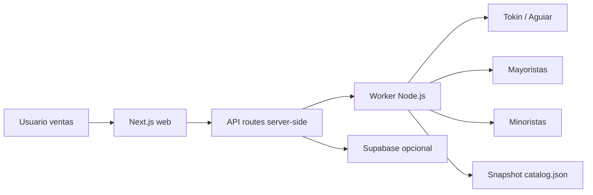

# Manual de uso y operacion

Este manual explica como usar Aguiar Gestion de Precios desde el punto de vista del area de ventas y como mantenerlo desde el punto de vista tecnico.

## Objetivo

La aplicacion ayuda a preparar y revisar listas de precios semanales. El usuario puede:

- Buscar categorias completas, por ejemplo alfajores, chocolates o jugos en polvo.
- Ver primero productos de Aguiar/Tokin y luego productos de competencia.
- Revisar precio unitario y precio por bulto cuando la fuente lo informa.
- Importar una lista de Excel, comparar contra fuentes externas y exportar el resultado.
- Guardar corridas para analizar evolucion.

## Mapa visual

```text
Aguiar Gestion de Precios

[ Categorias ] [ Busqueda general ] [ Importacion ] [ Evolucion ] [ Historial ] [ Configuracion ]

Categorias
  Buscar familia
  Familias sugeridas
  Detalle de familia
    Tokin / Aguiar
      Cards de productos con foto, marca, unidad y bulto
    Competencia
      Cards de productos comparables por fuente

Importacion
  Cargar Excel
  Revisar tabla/lista
  Descargar resultado
  Guardar corrida

Evolucion / Historial
  Ver corridas guardadas
  Comparar cambios de precios

Configuracion
  Validar sesiones privadas de fuentes mayoristas
  Detectar si Carrefour Comerciante ya devuelve precios visibles
```

## Pagina: Categorias

Ruta: `/`

Uso recomendado:

1. Escribir o elegir una familia, por ejemplo `alfajores`, `jugo en polvo`, `galletitas`, `mermeladas` o `chocolates`.
2. Abrir la familia detectada.
3. Revisar primero el bloque `Tokin / Aguiar`.
4. Comparar contra el bloque `Competencia`.
5. Entrar al link del producto cuando se necesite validar la fuente.

Que muestra cada card:

- Comercio: fuente del dato.
- Producto: nombre detectado.
- Tipo: mayorista o minorista.
- Marca: marca extraida si la fuente la informa.
- Unidad: precio unitario o precio equivalente normalizado.
- Bulto / pack: precio total del bulto si la fuente informa cantidad.
- Foto: imagen del producto si la fuente la devuelve.
- Link: acceso directo al producto cuando existe.

Ejemplo Tokin:

```text
Alfajor Hamlet Mousse Mani 34,5gr.
Unidad: $ 332,99
Bulto / pack: $ 13.319,47
Bulto: 40 unidades
```

Interpretacion: el sistema compara por unidad, pero conserva el valor del bulto para saber como vende Tokin.

## Pagina: Busqueda general

Ruta: `/busqueda-general`

Usar esta pagina cuando se necesita buscar un producto puntual.

Se puede buscar por:

- Nombre: `cereal mix frutilla`
- Abreviatura: `alf tatin`
- Codigo interno: `1012626`
- EAN: `7790040126268`
- SKU si la fuente lo devuelve

Resultado esperado:

- Aguiar/Tokin aparece separado cuando corresponde.
- Competidores se muestran con el ranking visual configurado.
- Fuentes sin stock se filtran fuera de los resultados.
- Si una fuente falla, el resto sigue funcionando.

## Pagina: Importacion

Ruta: `/importacion`

Usar esta pagina para trabajar con la lista semanal completa.

Flujo:

1. Cargar el Excel de articulos.
2. Esperar la comparacion.
3. Revisar productos sin precio o con diferencias fuertes.
4. Descargar el resultado.
5. Guardar la corrida si se quiere usar para evolucion.

Columnas esperadas del Excel:

```text
Rubro
Descripcion Larga
Codigo
EAN 13 DI
EAN 13 BU
Precio Aguiar / Precio ARA / Precio actual
```

No todas las columnas son obligatorias, pero mientras mas datos haya mejor sera el matching. El EAN y el codigo interno ayudan mucho a evitar falsos positivos.

## Como leer la comparacion

La app separa dos conceptos:

- `Precio Aguiar`: precio propio detectado desde Tokin o cargado en la lista.
- `Precio de competencia`: precio encontrado en fuentes externas.

Colores y señales:

- Verde: precio encontrado y utilizable.
- Naranja/alerta: una fuente tiene mejor precio que Aguiar.
- Rojo suave: no hay precio propio ni referencia de mercado.
- Gris: fuente sin precio para ese producto.

Regla de orden visual de fuentes:

1. Vital
2. Carrefour Comerciante / Maxi Pedido
3. Maxi / Maxiconsumo
4. Carrefour
5. Cheek
6. Yaguar / Jaguar
7. Cucher Mercados
8. Revista

Si una fuente no existe todavia en el sistema, queda preparada para ordenarse correctamente cuando se agregue.

## Precio unitario y bulto

Muchas fuentes venden de formas distintas. Por eso el sistema guarda:

- `price`: precio publicado principal o precio total del bulto cuando corresponde.
- `comparisonPrice`: precio unitario o equivalente usado para comparar.
- `packageQuantity`: cantidad de unidades del bulto.
- `packageLabel`: descripcion del bulto.
- `priceCondition`: texto visible para explicar la condicion.

Ejemplo:

```text
Unidad: $ 332,99
Bulto / pack: $ 13.319,47
Bulto: 40 unidades
```

La comparacion de mercado se hace contra `$ 332,99`, pero el usuario tambien ve que el pedido real puede ser por bulto de 40 unidades.

## Pagina: Evolucion

Ruta: `/evolucion`

Sirve para comparar corridas guardadas.

Requisitos:

- Supabase configurado.
- `SUPABASE_PERSIST_PRICE_LISTS=true`.
- Haber guardado al menos una corrida desde Importacion.

Uso:

1. Abrir Evolucion.
2. Seleccionar periodo o corrida disponible.
3. Revisar variaciones de Aguiar y competencia.
4. Identificar productos que subieron, bajaron o quedaron sin referencia.

## Pagina: Historial

Ruta: `/historial`

Sirve para consultar corridas ya guardadas.

Uso:

1. Abrir Historial.
2. Entrar a una corrida.
3. Revisar detalle de articulos, precios y fuentes.
4. Usar el detalle para auditar una lista anterior.

## Pagina: Configuracion

Ruta: `/configuracion`

Sirve para validar sesiones de fuentes que no exponen precios publicos. El caso
principal es Carrefour Comerciante.

Estados posibles:

- `Sesion valida`: la cookie devuelve productos con precios visibles.
- `Precios privados`: la cookie devuelve productos, pero Carrefour aun oculta
  precios.
- `Sesion no autorizada`: la cookie no conserva el acceso al catalogo privado.
- `Falta cookie`: no hay sesion para probar.

Cuando la validacion da `Sesion valida`, cargar en el entorno del worker:

```bash
CARREFOUR_COMERCIANTE_ENABLED=true
CARREFOUR_COMERCIANTE_COOKIE=
CARREFOUR_COMERCIANTE_USER_AGENT=
CARREFOUR_COMERCIANTE_REGION=CHACO
CARREFOUR_COMERCIANTE_SELLER_ID=506
CARREFOUR_COMERCIANTE_DELIVERY_TYPE=envio
```

La cookie vence. Cuando Carrefour vuelva a mostrar precios privados, renovar la
sesion y redeployar el worker con la cookie actualizada.

## Depuracion para usuarios

Si un producto no aparece o aparece mal:

1. Ir al panel `Depuracion de busqueda`.
2. Descargar `CSV matching` o `JSON completo`.
3. Copiar el caso con:
   - descripcion del Excel
   - codigo interno
   - EAN
   - producto que existe en Tokin o competencia
   - fuente donde se vio manualmente

Casos comunes:

- La abreviatura del Excel no coincide con la fuente, por ejemplo `ALF.` contra `Alfajor`.
- La fuente informa pack o bulto y hay que normalizar por unidad.
- La fuente devuelve un producto similar pero de otro gramaje.
- La fuente exige login o no expone precio publico.
- El producto esta sin stock y se filtra.

## Guia tecnica

Arquitectura:



Principios tecnicos:

- El browser del usuario no scrapea.
- Las credenciales viven en el worker o en variables server-side.
- Si una fuente falla, no bloquea toda la busqueda.
- Los resultados se normalizan antes de mostrarse.
- Los productos sin stock se excluyen.
- El historial se guarda solo cuando el usuario guarda una corrida.

## Comandos locales

Instalar:

```bash
npm install
npx playwright install chromium
```

Correr worker:

```bash
npm run dev:worker
```

Correr frontend:

```bash
npm run dev:web
```

Validar tipos:

```bash
npm run typecheck
```

Build:

```bash
npm run build
```

## Endpoints frontend

Estos endpoints viven en Next.js y llaman al worker:

- `POST /api/live-search`
- `POST /api/category-search`
- `POST /api/price-list`
- `POST /api/price-list/save`
- `GET /api/price-list/history`
- `GET /api/price-list/evolution`

## Endpoints worker

- `GET /health`
- `GET /catalog`
- `POST /catalog/sync`
- `POST /catalog/search`
- `POST /catalog/category-search`
- `POST /catalog/price-list`
- `POST /search`

## Variables tecnicas principales

Frontend:

```bash
WORKER_URL=http://127.0.0.1:4000
SUPABASE_URL=
SUPABASE_SECRET_KEY=
SUPABASE_SERVICE_ROLE_KEY=
SUPABASE_PERSIST_PRICE_LISTS=true
```

Worker:

```bash
PORT=4000
HEADLESS=true
SOURCE_TIMEOUT_MS=20000
MIN_CONFIDENCE_SCORE=60
TOKIN_ENABLED=true
TOKIN_EMAIL=
TOKIN_PASSWORD=
MAXICONSUMO_ENABLED=true
MAXICONSUMO_EMAIL=
MAXICONSUMO_PASSWORD=
YAGUAR_ENABLED=true
YAGUAR_EMAIL=
YAGUAR_PASSWORD=
VEA_ENABLED=true
VEA_EMAIL=
VEA_PASSWORD=
CARREFOUR_ENABLED=true
CARREFOUR_EMAIL=
CARREFOUR_PASSWORD=
AI_MATCHING_ENABLED=false
OPENAI_API_KEY=
```

## Fuentes y prioridad

Fuentes actuales o preparadas:

| Fuente | Tipo | Alcance | Estado |
| --- | --- | --- | --- |
| Aguiar Resistencia / Tokin | mayorista | Resistencia, Chaco | requiere credenciales |
| Supermayorista Vital Online | mayorista | Argentina | preparada, requiere login confiable |
| Maxiconsumo Chaco | mayorista | Resistencia, Chaco | activa si esta habilitada |
| Maxiconsumo Web | mayorista | Argentina | activa como referencia |
| Carrefour Argentina | minorista | Argentina | activa por API |
| Yaguar Chaco | mayorista | Chaco | requiere credenciales |
| Vea Argentina | minorista | Argentina | activa por API |
| Jumbo Argentina | minorista | Argentina | activa por API |
| Disco Argentina | minorista | Argentina | activa por API |
| DIA Argentina | minorista | Argentina | activa por API |
| La Anonima | minorista | Argentina | HTML publico |
| MasOnline / ChangoMas | minorista | Argentina | activa por API |
| Cordiez | minorista | Argentina | activa por API |
| Depot Express | minorista | Argentina | HTML publico |
| Sabor y Aroma Mayorista | mayorista | Formosa | HTML publico |

## Matching con IA

La IA es opcional. Solo debe activarse si se quiere mejorar matches dudosos y hay presupuesto disponible.

Uso recomendado con presupuesto bajo:

```bash
AI_MATCHING_ENABLED=true
AI_MATCHING_MODEL=gpt-4.1-nano
AI_MATCHING_MIN_CONFIDENCE=82
AI_MATCHING_MAX_CANDIDATES=5
AI_MATCHING_TIMEOUT_MS=6000
```

La IA no busca precios. Solo elige entre candidatos que ya devolvio una fuente.

## Checklist antes de publicar

- Worker responde `GET /health`.
- Frontend tiene `WORKER_URL` apuntando al worker publicado.
- Credenciales cargadas en el host del worker.
- `npm run typecheck` pasa.
- Probar una categoria con Tokin, por ejemplo `alfajores`.
- Probar una busqueda individual por EAN.
- Importar una lista chica y descargar resultado.
- Guardar una corrida y verificar Historial/Evolucion si Supabase esta activo.

## Problemas frecuentes

No aparece Aguiar/Tokin:

- Revisar `TOKIN_ENABLED=true`.
- Revisar `TOKIN_EMAIL` y `TOKIN_PASSWORD`.
- Revisar logs del worker.

No aparece Maxiconsumo:

- Revisar `MAXICONSUMO_ENABLED=true`.
- Revisar que la fuente responda desde el host.
- Validar si el producto esta sin stock.

Precio por bulto mal interpretado:

- Abrir el producto en la fuente.
- Confirmar si el precio mostrado corresponde a unidad, display, caja o bulto.
- Pasar captura y JSON/CSV de depuracion para ajustar normalizacion.

Productos parecidos pero de distinto gramaje:

- Revisar descripcion, EAN y codigo.
- Usar el log de candidatos descartados.
- Ajustar aliases o reglas de presentacion.
